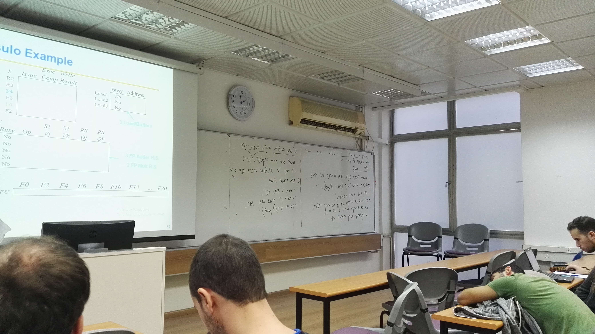
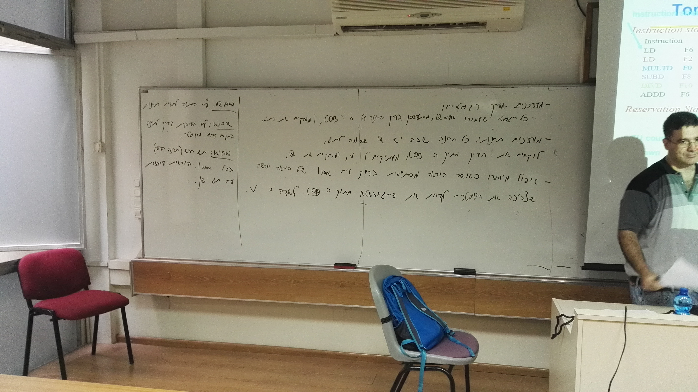

# T Sim
```
cd src
python assm2hex.py assm.txt
cd ..
mkdir build
cd build
cmake ..
make 
ln -s ../src/memin.txt memin.txt
./sim
```


output is :
```
In Resv -> op:LD,d:6,s0:0,s1:0,i:34
In Resv -> op:LD,d:2,s0:0,s1:0,i:45
In Resv -> op:MULT,d:0,s0:2,s1:4,i:0
In Resv -> op:SUB,d:8,s0:6,s1:2,i:0
In Resv -> op:DIV,d:10,s0:0,s1:6,i:0
In Resv -> op:ADD,d:6,s0:8,s1:2,i:0
0x00600022 0 ld0 2 2 4 5
0x0020002d 1 ld1 3 3 5 6
0x04024000 2 mult0 4 6 16 17
0x03862000 3 add0 5 6 8 9
0x05a06000 4 div0 6 17 29 30
0x02682000 5 add1 7 9 11 12
0x06000000 28  30 -1 -1 -1

F0:8
F1:1
F2:2
F3:3
F4:4
F5:5
F6:2
F7:7
F8:0
F9:9
F10:4
F11:11
F12:12
F13:13
F14:14
F15:15
```




